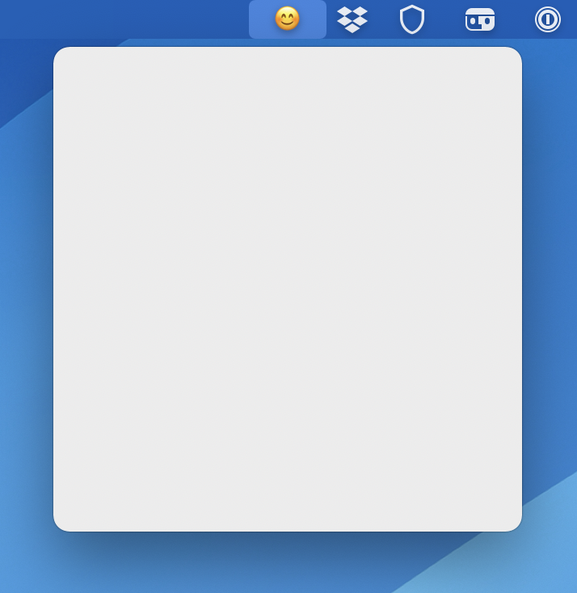

This sample project demonstrates a custom `NSWindowController` that can be attached to a `NSStatusItem` on macOS, such that it behaves similarly to `NSPopover`, but without the popover animations and pointy bit. The code was extracted from my app [AirBuddy](https://airbuddy.app).



Creating the controller is easy, it needs a status item to be its "target", and a view controller for its contents:

```swift
windowController = StatusBarMenuWindowController(
    statusItem: // your status item,
    contentViewController: // any view controller
)
```

**Important: the contentViewController must have its `preferredContentSize` set, the window will automatically resize itself based on that (including if it changes while visible).**

To present the window attached to the status item:

```swift
windowController.showWindow(sender)
```

If the status item's underlying window can't be found, the window will be positioned centered on screen as a fallback.

The implementation of `StatusBarMenuWindowController` also does a few things to make it behave more like system items like Control Center on macOS 11+, such as posting menu tracking notifications which cause the Menu Bar to stay expanded while it's visible on top of a full screen application.